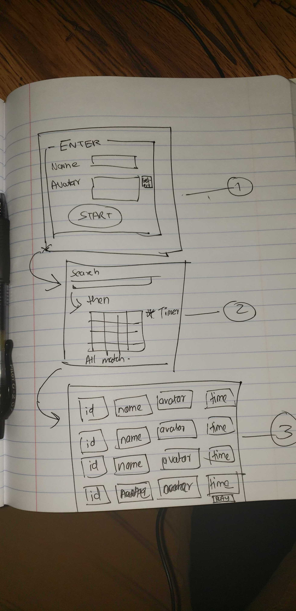

# Project 2- eMatch Game 
**Firuza, Shirley, Honora, Zachariah**
 
This is an interactive memory game that players can compete with others in real-time. Players are asked to pick their username and avatar to start the game. Players are able to search their interested field, topic to play with. Once the players enter their choice, the timer will automatically start and their moves will start to be counted. The times and numbers of moves will be recorded to be ranked. 
​
## Getting Started ##
​

Layout and information flow
​

Create a Username  
​

Topic Search Page
​

Game starts with timer and clicks showing
​

Game ends with 8 sets of completion 
​

Score is showing and can restart to have a better score
​
**Front-End Technology**
* CSS
* HTML
* Javascript
* JQuery
* JSON
* NPM
​
**Back-End Technology**
* MySQL Database with Sequelize ORM
* GET and POST routes for retrieving and adding new Data
* Heroku (with Data)
* API (google Images)
* Node.js
* Express.js
​
**Future Additions**
For a future advance, two major things can be added:
* Avatar image: we would like to have the avatar image showing for the players to choose
* Database: we would like to include two databases (username and score) instead of one and have them connect to each other. When players are restarting, they are able to keeptrack of the name they used and the score they got.